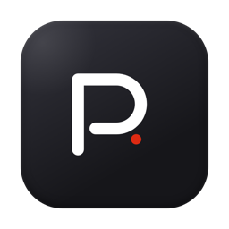
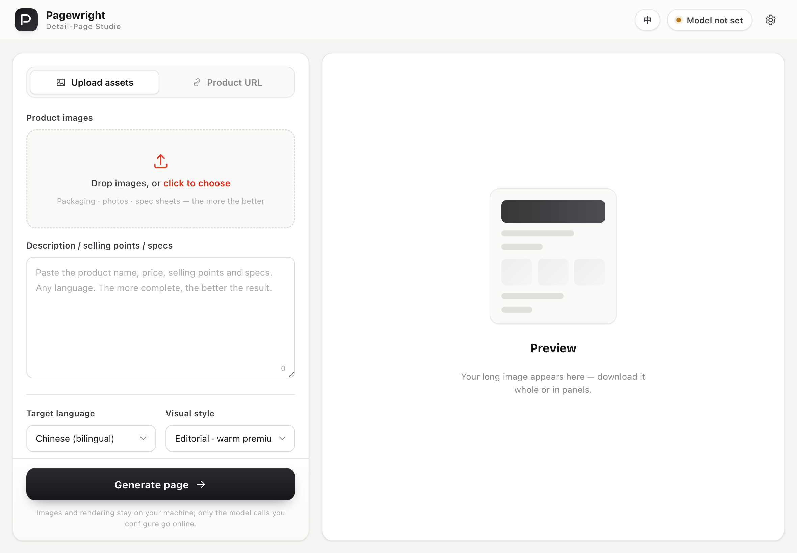
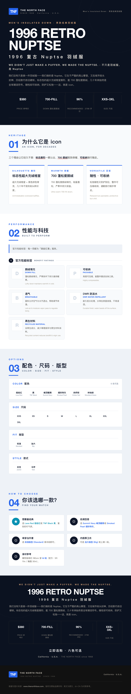
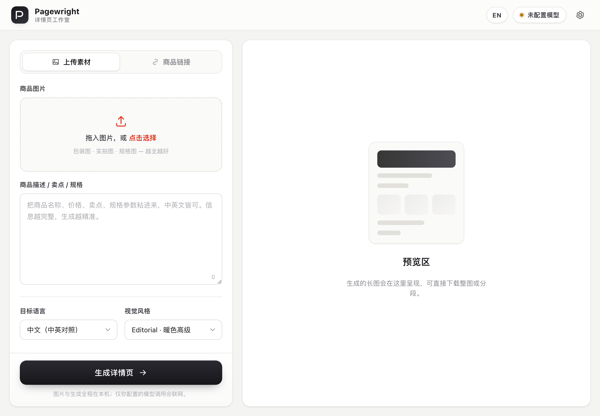

<div align="center">



# Pagewright

**LLM-orchestrated e-commerce detail-page (详情页) generator**
**用通用大模型，一键生成电商商品长图详情页**

[](LICENSE)


**[English](#english) · [中文](#中文)**



</div>

---

## Demo · 演示

**Selling a real product, end to end.** Pagewright read the live North Face
[*1996 Retro Nuptse Jacket*](https://www.thenorthface.com/en-us/p/mens/mens-jackets-and-vests/mens-insulated-and-down-300771/mens-1996-retro-nuptse-jacket-NF0A3C8D)
page — which is Akamai bot-protected, so `curl` is blocked and it's fetched through a **real
browser (tier-3)** — pulled the real price, 700-fill down spec, six colorways, sizes and the
official benefit ratings + description, then rendered this **bilingual 详情页**.

> Pagewright 读取了 North Face《1996 Retro Nuptse》线上商品页（站点有 Akamai 反爬，`curl` 被挡 →
> 经**真实浏览器（tier-3）**抓取），取到真实价格、700 蓬松鹅绒、6 配色、尺码与官方性能标签及文案，
> 渲染出这张**中英对照详情页**。

<p align="center"></p>

<sub>Real copy & data shown above. **Product photos are fetched at run time and are NOT committed
to this repo** (© The North Face) — the engine renders text/monogram fallbacks where an image is
absent. Reproduce it from [`examples/north_face_nuptse`](examples/north_face_nuptse) (add the
photos per its `ASSETS.md`). Other bundled example: [`examples/sa_infinity`](examples/sa_infinity).
此图仅含真实文案与数据；产品实拍图在运行时抓取、不随仓库分发（版权归 The North Face）。</sub>

---

## English

Give Pagewright a **product URL** or your **own images + a description**, and it produces a
polished, optionally **bilingual** long-image — the kind of detail page you upload to Taobao /
Tmall / Amazon / Shopify — rendered **pixel-accurately from real assets, not AI-painted**.

```
acquire ─▶ extract ─▶ enrich ─▶ compose ─▶ render ─▶ verify
 (URL)      (LLM)    (optional)  (HTML)    (PNG)    (LLM QA)
```

### The one idea that matters
**The LLM understands, writes, translates and lays out — it never generates factual pixels.**
Icons, product photos and spec numbers are *real files* referenced in HTML and rendered
deterministically by a headless browser. (The project this grew from first tried full
AI-image-generation; it hallucinated the technology icons. Switching to *"LLM authors a data
spec → real assets → HTML → screenshot"* made it pixel-accurate and **verifiable**.) Everything
flows through one contract, [`ProductSpec`](pagewright/spec.py), so any input source and any
template plug together.

### Two ways to use it

**A. Desktop app — for non-technical users.** Double-click, no Python, no terminal. Upload
photos + paste a description (or a URL), pick a language, click *Generate*, download the long
image. Bilingual UI (English / 中文, switch top-right). Users paste their own model key once.

> **Download:** build it with one command (below) → `dist/Pagewright.dmg` (macOS) or
> `dist/Pagewright/Pagewright.exe` (Windows). Or grab a release from the Releases page.

**B. CLI / library — for developers.**
```bash
pip install -e ".[all]"
playwright install chromium        # for JS-site/Cloudflare scraping & rendering (optional)
cp .env.example .env               # set PAGEWRIGHT_LLM + your key

# Reproduce the bundled example (no key needed — pure compose + render):
pagewright compose examples/sa_infinity/product_spec.json --theme editorial -o /tmp/sa.html
pagewright render /tmp/sa.html -o /tmp/out && open /tmp/out/full.png

# From your own uploads, end-to-end, bilingual:
pagewright run --manual examples/manual_demo --target-lang zh-CN --out /tmp/demo

# From a product URL:
pagewright run "https://store.example.com/p/widget" --target-lang zh-CN --out /tmp/widget
```

### Generation library — every result is kept
Every generation is auto-saved to a local library at `~/.pagewright/library/` (self-contained:
full image, panels, the `ProductSpec`, and a thumbnail). The desktop app's **History** panel
browses them grouped by product with version badges (v1, v2…) — view, download, **re-render** an
old spec into a new version, or delete. CLI: `pagewright library list|open|path|rm`. Nothing
leaves your machine.

### How acquisition covers *most* sites — the layered fetcher
No per-site parsers. A layered fallback fetcher auto-escalates; whatever tier wins, the captured
**text + screenshots** go to the LLM, which returns a schema-valid `ProductSpec`:

| Tier | Engine | Handles | Needs |
|---|---|---|---|
| **1** | `httpx` + `trafilatura` | static / server-rendered | nothing |
| **2** | Playwright headless | JS / SPA, light bot checks | `playwright` |
| **3** | attach to **your own** Chrome (CDP) | Cloudflare, login walls | you launch Chrome `--remote-debugging-port=9222`, already logged in |

Tier-3 reuses a browser **you** authenticated — Pagewright never solves a CAPTCHA or bypasses
auth. `robots.txt` is honored and requests are rate-limited.

### Pipeline
| Stage | What it does |
|---|---|
| **acquire** | layered fetcher → `RawCapture` (html, text, screenshots, images) |
| **extract** | LLM reads capture **or** uploads → `ProductSpec` |
| **enrich** | translate (bilingual), classify image roles, **match real icons** (never draw), `rembg` cut-outs |
| **compose** | `ProductSpec` + theme → one self-contained HTML (Jinja2 block library) |
| **render** | headless screenshot → auto-crop → slice into upload panels (Pillow) |
| **verify** | multi-lens LLM QA + deterministic integrity checks → report |

Each stage writes a human-editable artifact (`spec.json`, `page.html`, the PNGs) — fix any step
by hand and re-run only what's downstream.

### Swappable LLM — not bound to Claude or MCP
There is **no default vendor** and **no MCP dependency** (`anthropic` is a lazy optional
import). Pick a backend with `PAGEWRIGHT_LLM`:
- **Cloud, any vendor:** `openai` + `OPENAI_BASE_URL` → DeepSeek, Qwen, Moonshot, Together…
- **Fully local, no key:** point `OPENAI_BASE_URL` at Ollama / vLLM / LM Studio (needs a
  vision model for the extract step). Structured output degrades gracefully for servers without
  strict schema support.
- The whole **compose + render** half needs no model at all.

### Themes
Themes are design tokens (colors + fonts). Built-ins: `editorial` (warm premium) and `cool`
(tech blue). Pass `--theme path/to/yours.toml` for your own.

### Security & privacy
Local-first: uploads and rendering stay on your machine; only the LLM calls you configure go
out. Spec text from untrusted pages is sanitized before rendering (`safe_inline`). The web
server binds `127.0.0.1`. See [SECURITY.md](SECURITY.md). Brand assets fetched from sites
belong to their owners and are **not** redistributed by this project.

### Build the desktop app
```bash
bash packaging/build_macos.sh      # → dist/Pagewright.app
bash packaging/build_dmg.sh        # → dist/Pagewright.dmg  (drag-to-Applications)
packaging\build_windows.bat        # → dist\Pagewright\Pagewright.exe  (run on Windows)
```
Custom icon and signing/notarization notes are in [packaging/README.md](packaging/README.md).

### Project layout
```
pagewright/  spec.py · cli.py · config.py
  acquire/ extract/ enrich/ compose/ render/ verify/ llm/ app/
examples/    sa_infinity/ (worked example) · manual_demo/
packaging/   pagewright.spec · build_*.sh/.bat · icon/
tests/       pytest (spec / slice / compose — no network)
```

### License
[MIT](LICENSE) for the engine. Third-party brand content is not covered and not redistributed.

---

## 中文

<div align="center"></div>

给 Pagewright 一个**商品链接**，或你**自己的图片 + 一段描述**，它就生成一张精致、可选**中英对照**的
长图——就是你上传到淘宝 / 天猫 / 亚马逊 / Shopify 的那种详情页——并且是**用真实素材像素级渲染，而非
AI 凭空画图**。

```
采集 ─▶ 抽取 ─▶ 增强 ─▶ 合成 ─▶ 渲染 ─▶ 校验
(URL)  (大模型) (可选)  (HTML)  (PNG)  (大模型质检)
```

### 最核心的一个理念
**大模型只负责理解、文案、翻译与排版；绝不生成"事实像素"。** 图标、产品图、规格数字一律是*真实文件*，
写进 HTML 由无头浏览器确定性渲染。（本项目脱胎的那个需求，最初用整图 AI 生成，结果把科技图标画错了；
改成 *"大模型产出数据规格 → 真实素材 → HTML → 截图"* 后，既像素精准又**可核验**。）所有环节只通过一个
契约 [`ProductSpec`](pagewright/spec.py) 衔接，因此任意来源、任意模板都能自由拼装。

### 两种用法

**A. 桌面客户端 —— 给不懂技术的人用。** 双击即开，免装 Python、免命令行。上传图片 + 粘描述（或贴链接），
选语言，点「生成」，下载长图。界面**中英双语**（右上角切换）。模型 Key 由用户自己在设置里填一次。

> **获取：** 一条命令构建（见下）→ `dist/Pagewright.dmg`（macOS）或
> `dist/Pagewright/Pagewright.exe`（Windows）；也可从 Releases 页直接下载。

**B. 命令行 / 库 —— 给开发者用。**
```bash
pip install -e ".[all]"
playwright install chromium        # JS 站/Cloudflare 抓取与渲染（可选）
cp .env.example .env               # 配置 PAGEWRIGHT_LLM 和你的 Key

# 复现内置范例（无需 Key——纯合成+渲染）：
pagewright compose examples/sa_infinity/product_spec.json --theme editorial -o /tmp/sa.html
pagewright render /tmp/sa.html -o /tmp/out && open /tmp/out/full.png

# 用你自己的素材，端到端，中英对照：
pagewright run --manual examples/manual_demo --target-lang zh-CN --out /tmp/demo

# 从商品链接：
pagewright run "https://store.example.com/p/widget" --target-lang zh-CN --out /tmp/widget
```

### 作品库 —— 每次生成都留底
每次生成都会自动存到本地作品库 `~/.pagewright/library/`（自包含：长图、分段、`ProductSpec`、缩略图）。
桌面 App 的**历史**面板按商品分组浏览，带版本徽章（v1、v2…）——可查看、下载、把旧版 spec **重渲染**为
新版本、或删除。命令行：`pagewright library list|open|path|rm`。全程不出本机。

### 采集如何覆盖"绝大多数"站点 —— 分层兜底抓取
不写逐站解析器。分层抓取器自动逐级升级；无论哪一级抓到，都把**正文 + 截图**交给大模型，产出
schema 合法的 `ProductSpec`：

| 层 | 引擎 | 覆盖 | 依赖 |
|---|---|---|---|
| **1** | `httpx` + `trafilatura` | 静态 / 服务端渲染 | 无 |
| **2** | Playwright 无头 | JS / SPA、轻度反爬 | `playwright` |
| **3** | 接管**你本机**的 Chrome（CDP） | Cloudflare、登录墙 | 你以 `--remote-debugging-port=9222` 起 Chrome 并已登录 |

第 3 层复用的是**你本人**已通过验证的浏览器——Pagewright 不破解验证码、不绕过登录。默认尊重
`robots.txt` 并限速。

### 流水线
| 阶段 | 作用 |
|---|---|
| **采集 acquire** | 分层抓取 → `RawCapture`（html、正文、截图、图片） |
| **抽取 extract** | 大模型读取 capture **或** 上传素材 → `ProductSpec` |
| **增强 enrich** | 翻译（中英对照）、图片角色分类、**匹配真实图标**（绝不生成）、`rembg` 抠图 |
| **合成 compose** | `ProductSpec` + 主题 → 一份自包含 HTML（Jinja2 区块库） |
| **渲染 render** | 无头截图 → 自动裁白 → 切成可上传的分段（Pillow） |
| **校验 verify** | 多镜头大模型质检 + 确定性完整性检查 → 报告 |

每个阶段都落一个**人类可改**的中间产物（`spec.json`、`page.html`、PNG），手动修任一步后只需重跑其下游。

### 可插拔大模型 —— 不绑定 Claude，也不依赖 MCP
**无默认厂商**、**零 MCP 依赖**（`anthropic` 仅按需惰性导入）。用 `PAGEWRIGHT_LLM` 选后端：
- **云端任意厂商：** `openai` + `OPENAI_BASE_URL` → DeepSeek、通义千问、Moonshot、Together…
- **完全本地、零 Key：** `OPENAI_BASE_URL` 指向 Ollama / vLLM / LM Studio（抽取环节需带视觉的模型）；
  对不支持严格 schema 的服务自动降级。
- **合成 + 渲染**这半边根本不需要任何模型。

### 主题
主题就是设计令牌（配色 + 字体）。内置 `editorial`（暖色高级）与 `cool`（科技蓝）。用
`--theme 路径.toml` 接入你自己的主题。

### 安全与隐私
本地优先：上传与渲染都在你机器上，只有你配置的模型调用会联网。来自不可信页面的文本在渲染前会被
净化（`safe_inline`）。Web 服务仅绑定 `127.0.0.1`。详见 [SECURITY.md](SECURITY.md)。从站点抓取的
品牌素材版权归原方，本项目**不再分发**。

### 构建桌面客户端
```bash
bash packaging/build_macos.sh      # → dist/Pagewright.app
bash packaging/build_dmg.sh        # → dist/Pagewright.dmg（拖入 Applications 安装）
packaging\build_windows.bat        # → dist\Pagewright\Pagewright.exe（在 Windows 上运行）
```
自定义图标与签名/公证说明见 [packaging/README.md](packaging/README.md)。

### 目录结构
```
pagewright/  spec.py · cli.py · config.py
  acquire/ extract/ enrich/ compose/ render/ verify/ llm/ app/
examples/    sa_infinity/（完整范例）· manual_demo/
packaging/   pagewright.spec · build_*.sh/.bat · icon/
tests/       pytest（spec / slice / compose——不联网）
```

### 许可
引擎采用 [MIT](LICENSE)。第三方品牌内容不在许可范围内，且不随仓库分发。
